# Biway

<p align="center">
  
</p>

[](https://github.com/KybexOnline/biway/releases)

Biway is a self-hosted WireGuard® mesh networking platform that securely connects servers across multiple cloud providers, data centers, VPS providers, and bare-metal environments into a single private network.

Whether your infrastructure spans AWS, Hetzner, DigitalOcean, Oracle Cloud, Azure, GCP, or your own hardware, Biway automates peer configuration, IP allocation, and WireGuard management through a centralized web interface.

---

## 🚀 Quick Install (Recommended)

Install **biway-admin** with a single command:

```bash
curl -fsSL https://raw.githubusercontent.com/KybexOnline/biway/main/install.sh | bash - 
```

This script will:
* Download the latest biway-admin binary
* Set up the necessary directories and systemd service (if desired)
* Initialize the database
* Start the server

After installation, open your browser to http://your-server-ip:8500 and complete the setup wizard.


---

## ✨ Features

### 🔒 Self-Hosted Control Plane

Deploy Biway on your own infrastructure and domain. Your network, encryption keys, and configuration remain completely under your control.

### 🌍 Multi-Cloud Networking

Build a private mesh network between servers running on different cloud providers and on-premises environments.

### ⚡ WireGuard® Powered

Built on top of WireGuard®, providing fast, secure, and modern VPN connectivity with industry-leading cryptography.

### 🤖 Automatic Node Provisioning

New nodes automatically generate their WireGuard keys, register with the control plane, and receive their network configuration.

### 🧮 Smart IP Management

Configure your own private CIDR block while Biway automatically assigns IP addresses and prevents conflicts.

### 📡 Dynamic Peer Synchronization

Agents continuously monitor the control plane and apply configuration updates without interrupting existing tunnels.

### 📊 Centralized Dashboard

Manage your entire mesh network from a single interface, including nodes, networking, authentication, and monitoring.

---

## 🏗 Architecture

Biway consists of two core components.

### biway-admin

The centralized control plane responsible for:

- REST API
- Web Dashboard
- Authentication
- Database Management
- IP Allocation
- Peer Configuration
- Network State Management

### biway-agent

A lightweight daemon installed on every server that:

- Generates WireGuard keys
- Registers with the Admin API
- Receives peer configurations
- Configures WireGuard
- Maintains peer synchronization

---

## 📐 Architecture Overview

```text
                    +----------------------+
                    |     biway-admin      |
                    |----------------------|
                    | REST API             |
                    | Dashboard            |
                    | SQLite Database      |
                    | Authentication       |
                    +----------+-----------+
                               |
                 Configuration & Peer Sync
                               |
        -------------------------------------------------
        |                     |                         |
+---------------+     +---------------+      +---------------+
| biway-agent   |     | biway-agent   |      | biway-agent   |
| AWS           |     | Hetzner       |      | Bare Metal    |
+---------------+     +---------------+      +---------------+
        \                     |                        /
         \____________________|_______________________/
                  Secure WireGuard Mesh Network
```

---

## 🚀 Quick Start

Clone the repository.

```bash
git clone https://github.com/KybexOnline/biway.git
cd biway
```

Build the Admin Server.

```bash
go build -o biway-admin ./cmd/admin
```

Initialize the database.

```bash
./biway-admin db-migration --database biway.sqlite
```

Start the server.

```bash
./biway-admin serve --listen 0.0.0.0 --port 8500
```

Open your browser.

```
http://localhost:8500
```

Complete the setup wizard and create your first administrator account.

---

## 📦 Building Agents

Build the agent binary.

```bash
go build -o biway-agent ./cmd/agent
```

Initialize its configuration.

```bash
./biway-agent init-config
```

Edit the generated `agent.yaml` and configure:

- Admin API URL
- Node Token
- Optional networking settings

Start the agent.

```bash
sudo ./biway-agent start --interface-name biway01
```

The agent will automatically:

- Generate a WireGuard key pair
- Register with the Admin Server
- Receive a private mesh IP
- Download peer configurations
- Configure WireGuard
- Maintain secure tunnels with other nodes

---

## 📚 Documentation

Additional documentation can be found in:

- [Build Documentation](docs/Build_selfhosted.md)

---

## 🛣️ Roadmap

Biway is actively under development. Here's what's planned for upcoming releases:

* [ ] Publish official Docker images for the Admin Dashboard
* [ ] High Availability (HA) Control Plane
* [ ] Windows Agent Support
* [ ] Prometheus Metrics & Monitoring
* [ ] DNS 
* [ ] User Accounts for Mesh Network Access
* [ ] Automatic NAT Traversal
* [ ] Audit Logs
* [ ] Configuration Backup & Restore
* [ ] Automatic Agent Updates


---

## 🤝 Contributing

Contributions are welcome.

Feel free to open Issues, submit Pull Requests, or suggest improvements.

---

## 📄 License

See the project's LICENSE file for licensing information.